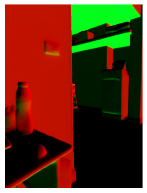

# 3D Point Cloud Creation for an Image using Monocular Depth Estimation
Calculate 3D point cloud from an image by estimating the depth of objects in the image and the projecting the depth in 3D using camera intrinsic parameters.

## Benchmark  Monocular Depth Estimation Model:  
Based on my research and recent developments in available monocular depth estimation, two models were selected:
   1) [Depth Anything Model-V2](https://github.com/LiheYoung/Depth-Anything)
   2) [Metric3D](https://github.com/YvanYin/Metric3D/tree/main)

Both the models offer great depth accuracy, but Metric 3D model stood out for me with the provided [configurations](https://github.com/devanjanmishra/DepthMaps_3DPointCloud_Creation/tree/main/mono/configs) for different conditions.

Metric3D models also provides with normal estimations from the model itself, rather relying on external libraries like opencv,open3d which is an additional benefit.
Sample Inclusion from [output](https://github.com/devanjanmishra/DepthMaps_3DPointCloud_Creation/tree/main/data/sample_output):

  

    
<strong>Input: RGB Image</strong>

    
  

  

    
<strong>Output: Depth Image</strong>

    
  

  

    
<strong>Output: Normals Image</strong>

    
  

